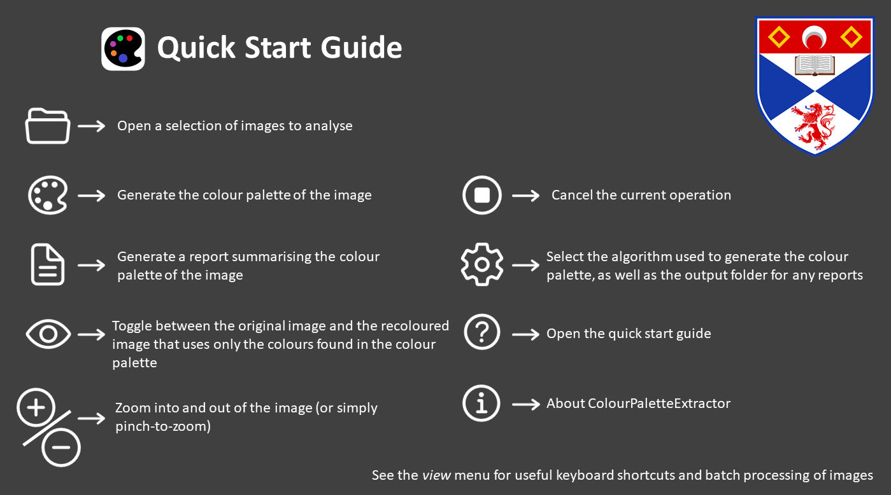

# ColourPaletteExtractor

```ColourPaletteExtractor``` is a simple tool to generate the colour palette of an image. Built using Python, it can be used
on a computer running either Windows 10, or an Intel Mac running macOS Mojave (10.14) or later. While the source code *may*
run on a computer using a Linux operating system, there is no guarantee that it will work. Additional tweaks may be necessary.
Furthermore, the compiled macOS version of ```ColourPaletteExtractor``` has not been tested on an Apple Silicon Mac; therefore,
it may be necessary to recompile the application.

## 1) Licencing
    ColourPaletteExtractor Copyright (C) 2021  Tim Churchfield
    This program comes with ABSOLUTELY NO WARRANTY; for details see LICENCE.md.
    This is free software, and you are welcome to redistribute it
    under certain conditions; see LICENCE.md for details.


## 2) Download Instructions

The latest version of ColourPaletteExtractor can be obtained from
[GitHub](https://github.com/PurpleCrumpets/ColourPaletteExtractor/releases). Download the ```zip``` 
file that best matches your computer's operating system (found under ```Assets```) and extract its contents to a suitable
location. For macOS, simply double-click the ```ColourPaletteExtractor``` application to open it. On Windows 10, open 
the ```ColourPaletteExtractor``` folder and double-click the ```ColourPaletteExtractor.exe``` executable file.


### 2.1) macOS Specifics

On opening the application for the first time on macOS, you may be met with a pop-up stating: 
```“ColourPaletteExtractor” can’t be opened because Apple cannot check it for malicious software.``` This is because the
application has not been signed and so Apple (arguably quite rightly) does not let you run it without an additional
hurdle. 

To allow for the application to be run, open ```System Preferences > Security & Privacy > General```. Make sure
that the setting for ```Allow apps downloaded from:``` is set to ```App Store and identified developers``` and click 
```Open Anyway``` for ```ColourPaletteExtractor```. 


### 2.2) Windows 10 Specifics

On Windows 10, your anti-virus software may decide to quarantine the ```ColourPaletteExtractor.exe``` file or other 
components of the application while it checks that they are not harmful.
This may take a while and prevent the application from running. It may be necessary to either add the folder containing 
the application to your anti-virus' whitelist (preferable), or disable your anti-virus whilst using the application (not
recommended, do so at your own risk). If disabling your anti-virus, **please** remember 
to turn it back on once you have finished! You may also need to run the application as an administrator.

In rare cases, no default algorithm will be selected when you open the application for the first time, preventing you
from generating a colour palette. If this occurs, please open up the Settings menu (```Ctrl+Alt+S```) and select the
algorithm you wish to use. This will be remembered the next time you open the application.

### 2.3) Uninstalling

To uninstall the application, simply delete the folder and its contents that you downloaded in Section 2.

ColourPaletteExtractor also creates a settings file, ```ColourPaletteExtractor.ini```, that is used to store your 
preferences between uses. This is not automatically removed when you delete the application and needs to be manually
deleted.

On macOS, this file can be found at the following path; simply delete the ```The University of St Andrews```
folder and its contents. If the ```.config``` folder does not appear in the ```YOUR_USERNAME``` folder, you will need to
make hidden folders visible. This can be done using the keyboard shortcut: ```Cmd+Shift+.```.

      /Users/YOUR_USERNAME/.config/The University of St Andrews/ColourPaletteExtractor.ini

On Windows 10, the same settings file can be found at:

      C:\Users\YOUR_USERNAME\AppData\Roaming\The University of St Andrews\ColourPaletteExtractor.ini


## 3) Operating Instructions

Upon opening the application, you will be greeted with a simple quick start guide. This explains how to
obtain the colour palette of an image, as well as how to generate a report that summarises this information. 
It is also possible to analyse multiple images simultaneously; options to generate the colour palette for all open
images and their summary reports can be found under the ```View``` menu of the application.

The recoloured image is created by reassigning each pixel's colour to the most representative colour found in the colour
palette. For the algorithm proposed by Nieves et al. (2020), this is the colour in the colour palette that is closest to
the pixel's colour in the CIELAB colour space (the shortest Euclidean distance). 

The colour palette report contains a graph showing the relative frequency of the colours in the colour palette when used 
to recolour the original image. On the X-axis of the graph, each label refers to the colour's sRGB triplet.

The time required to generate the colour palette of an image is directly proportional to the dimensions of the image.
It can take upwards of several minutes to obtain the colour palette of high resolution images. If multiple images are to be
anaylsed, it may be beneficial to scale down the resolution of the images to reduce the time required to process them. 
However, this *may* affect the make-up of the colour palette, as well as the relative frequency of each colour
in the recoloured image.




### 3.1) Using with Python

While the application itself can be used to process multiple image simultaneously, it may be preferable to use the 
algorithm that generates the colour palette as part of your own Python script. The ```model.py``` module has a simple
function, ```generate_colour_palette_from_image```, that can be used for this purpose. It can take two parameters, the
file path to the image to be analysed (compulsory), and the name of the algorithm's Python class (optional). By default,
the ```Nieves2020CentredCubes``` algorithm is used (see the [source paper](https://doi.org/10.1364/AO.378659) 
for more information). Alternative algorithms can be found in the ```colourpaletteextractor.model.algorithms``` package.

If you wish to use this function, please make sure
that you have installed Python 3.9 or later, as well as the Python packages listed in the ```requirements.txt```
[file](https://github.com/PurpleCrumpets/ColourPaletteExtractor/blob/master/requirements.txt) \*. It
may also be desirable to install these packages under a new Python virtual environment\*\* to prevent any conflicts with 
other packages you may have installed. 

A sample script, ```colourpaletteextractor/examples/generatecolourpaletteexample.py```, is provided that shows
how this can be achieved. It returns the recoloured image using only the colours found in the colour palette, the 
colour palette itself, and the relative frequencies of these colours in the recoloured image. To run this script, 
activate your new Python virtual environment (see Section 4), navigate to the ```ColourPaletteExtractor``` folder, and
use the following command to run the script (when using Windows, you may need to substitute ```python3``` with ```py```):

      python3 -m colourpaletteextractor.examples.generatecolourpaletteexample


Alternatively, it may be desirable to run the ```ColourPaletteExtractor``` application from the terminal.
In order to do so, activate your Python virtual environment, navigate to the ```ColourPaletteExtractor``` folder, and 
use the following command to run the application from the terminal:

      python3 -m colourpaletteextractor.__main__

If you wish to have a verbose output to the terminal when generating a colour palette or a colour palette report, the
variable ```__VERBOSE__```  in the ```_settings.py``` module will need to be changed from ```False``` to ```True```.


\* Please 
note that the ```Sphinx```, ```sphinx-rtd-theme```, ```rinohtype``` and ```pytest``` packages are only required if you
wish to rebuild the
documentation (the first three packages) or run the test suite for the implemented algorithms (the final package).

\*\* See the [Python Packaging User Guide](https://packaging.python.org/guides/installing-using-pip-and-virtual-environments/)
for more information on how to create and maintain a Python virtual environment.

### 3.2) Source Code Documentation

A set of [HTML files](https://github.com/PurpleCrumpets/ColourPaletteExtractor/tree/master/docs/build/html)
have been produced to support the future develop and maintenance of ```ColourPaletteExtractor```. These can be found in
the ```ColourPaletteExtractor/docs/build/html``` directory. The ```index.html``` contains the documentation homepage. 
The documentation is also available as a [PDF document](https://github.com/PurpleCrumpets/ColourPaletteExtractor/tree/master/docs/build/pdf).


## 4) Compiling Instructions

To build the ```ColourPaletteExtractor``` application from the source code, it is highly recommended that a new
Python virtual environment is set-up. This will allow for the minimum number of Python packages to be installed, 
reducing the size of the resultant application. Please install the Python packages listed in the ```requirements.txt```
[file](https://github.com/PurpleCrumpets/ColourPaletteExtractor/blob/master/requirements.txt). On macOS,
navigate to the directory containing the ```requirements.txt``` file and use the
following commands to install the required packages for your new Python virtual environment:

      source /path/to/my/Python/virtual/environment/bin/activate

      python3 -m pip install -r requirements.txt


On Windows, the following commands perform the same task:

      .\path\to\my\Python\virtua\environment\Scripts\activate

      py -m pip install -r requirements.txt


### 4.1) Configuration File

The ```macOS.config``` and ```windows_config.bat``` files (for macOS and Windows 10, respectively) are used to specify the
path to your Python virtual environment, as well as the output directory for the executables created by PyInstaller 
(see Section 4.2 below). Please update these files with the correct paths. 


### 4.2) Compiling the Executables

The ```macOS_create_executables.sh``` and ```windows_create_executables.bat``` scripts are used to build the application for macOS
and Windows 10, respectively. Please make sure that the configuration files (see Section 4.1) have been updated with
the path to your Python virtual environment, as well as the output directory you wish to use for the compiled application.

Please make sure that the relevant permissions have been set to allow for these script to be run (i.e.,
```chmod 755 create_executables.sh```). Navigate
to them using the terminal on macOS, or the command prompt on Windows 10 and run these files. If all goes well, you
should find the compiled applications inside the ```dist``` folder of your chosen output directory (i.e., ```ColourPaletteExtractor-Executables```). 

If you wish to update the author of the application, the name of the application, its current version number, or the
organisation associated 
with the application, please update the variables in the ```_version.py``` module accordingly. 

### 4.3) Compiling the Code Documentation

Additional documentation for the source code is available as a set of 
[HTML files](https://github.com/PurpleCrumpets/ColourPaletteExtractor/tree/master/docs/build/html) or 
as a [PDF document](https://github.com/PurpleCrumpets/ColourPaletteExtractor/tree/master/docs/build/pdf). 
On macOS and Windows 10, the ```macOS_create_documentation.sh``` and ```windows_create_documentation.bat``` scripts,
respectively, can be used to recompile the documentation. As with the
application build scripts discussed in Section 4.2, please make sure the configuration files have been updated to reflect
the path to your Python virtual environment.

Navigate to the ```ColourPaletteExtractor``` directory and run the appropriate script, making sure that the script has
the appropriate execution permissions as discussed before in relation to the application build scripts (Section 4.2).

## 5) Running the Algorithm's Unit Tests

A suite of unit tests were developed to help confirm that the implemented colour palette extraction algorithm was working
as intended. These can be found in ```tests/nieves2020_test.py``` module. The ```macOS_test_suite_runner.sh``` and 
```windows_test_suite_runner.bat``` scripts be used to run these tests on macOS and Windows 10, respectively. 
As with the build scripts (Section 4.2), please make sure the configuration files have been updated to 
reflect the path to your Python virtual environment.

Please also make sure that the relevant permissions have been set to allow the script to be executed 
(```chmod 755 test_suite_runner.sh```). Using the terminal, navigate to the ```ColourPaletteExtractor``` directory
and run the appropriate script. The results from the test suite are printed to the terminal.


## 6) Implementing a New Algorithm

Implementing a new algorithm is relatively straight-forward as most of the infrastructure is already in place. Please
follow the instructions below to add a new algorithm to the application.

1) Create a new subclass of ```PaletteAlgorithm``` in a new module ```mymodule.py``` of the ```algorithms``` package 
   using the following template:
   
```python
import numpy as np

import colourpaletteextractor.model.algorithms.palettealgorithm as palettealgorithm

class MyNewAlgorithm(palettealgorithm.PaletteAlgorithm):

    name = "Boggis, Bunce and Bean (1970)"
    url = "www.one-fat-one-short-one-lean.com"

    def __init__(self):
        """Constructor."""
        super().__init__(MyNewAlgorithm.name, MyNewAlgorithm.url)

    # Add any further code here that you require...

    def generate_colour_palette(self, image: np.array) -> tuple[np.array, list[np.array], list[float]]:

        # Generate the colour palette for the image here
      
        # Set the initial progress
        self._set_progress(0)  # Initial progress = 0%
        if not self._continue_thread:
            return None, [], []
      
      
        # Increment the progress by a fixed amount
        self._increment_progress(increment_percent)
        if not self._continue_thread:
            return None, [], []
      
      
        # Set the final progress   
        self._set_progress(100)  # Final progress = 100%
        if not self._continue_thread:
            return None, [], []
      
        return recoloured_image, colour_palette, relative_frequencies

```
      

Please specify a ```name``` for the algorithm and a ```url``` to a valid website or file to allow for users to learn more
about how your algorithm works. The ```MyNewAlgorithm``` class inherits the abstract method ```generate_colour_palette```
from the abstract ```PaletteAlgorithm``` class. The ```image``` object is an ```np.array``` representing the image
to be analysed. It is either an [x, y, 3] or [x, y, 4] matrix, with the third dimension representing the red, 
green and blue colour channels of the 8-bit sRGB colour space. The fourth channel may sometimes occur if the image
has a transparency layer (e.g., some PNG images) and may need to be removed depending on your approach to generating the
colour palette.

The output from the method should be an ```np.array``` representing the recoloured image using only the colours found in the
colour palette, the colours in the colour palette as a list of RGB triplets, each represented by an ``np.array``, and the list of relative frequencies 
of each colour in the colour palette as found in the recoloured image, each stored as a ```float```. 

2) Add the following import statement for the new module ```mymodule.py``` to the top of the ```model.py``` module so
   the new algorithm can be picked up by the GUI and added as a new algorithm in the settings panel.
   
        from colourpaletteextractor.model.algorithms import mymodule


### 6.1) Adding Progress Bar Updates

While not technically necessary, it may be desirable to provide progress updates for the user while the colour palette
is being generated. The ```PaletteAlgorithm``` class provides two methods that can be used for this purpose, 
```_set_progress``` and ```_increment_progress``` (see the above example). The former method can be used to set the percentage progress
to a fixed amount (no more than 100%). The latter can be used to increase the progress bar by a certain
number of percentage points. This may be useful in a loop scenario, where a set progress percentage for a particular
loop can be divided up over the loop. 

By updating the progress bar, the execution status set by the user is also checked. By adding the following two
lines of code underneath any progress bar update (see the example above for how it could be used), the 
generation of the colour palette can be gracefully cancelled by the user.

      if not self._continue_thread:
        return None, [], []


### 6.2) Changing the Default Algorithm
Changing the default algorithm used by ```ColourPaletteExtractor``` is very straightforward, requiring a
small change to the ```ColourPaletteExtractorModel``` class (found in the ```model.py``` module). To set the default algorithm
to your new algorithm, edit the ```DEFAULT_ALGORITHM``` static variable of the ```ColourPaletteExtractorModel``` class to your new 
algorithm:

      class ColourPaletteExtractorModel:
         DEFAULT_ALGORITHM: type[PaletteAlgorithm] = mymodule.MyNewAlgorithm


Note: This is the name of the class, *not* an instance of the class!
